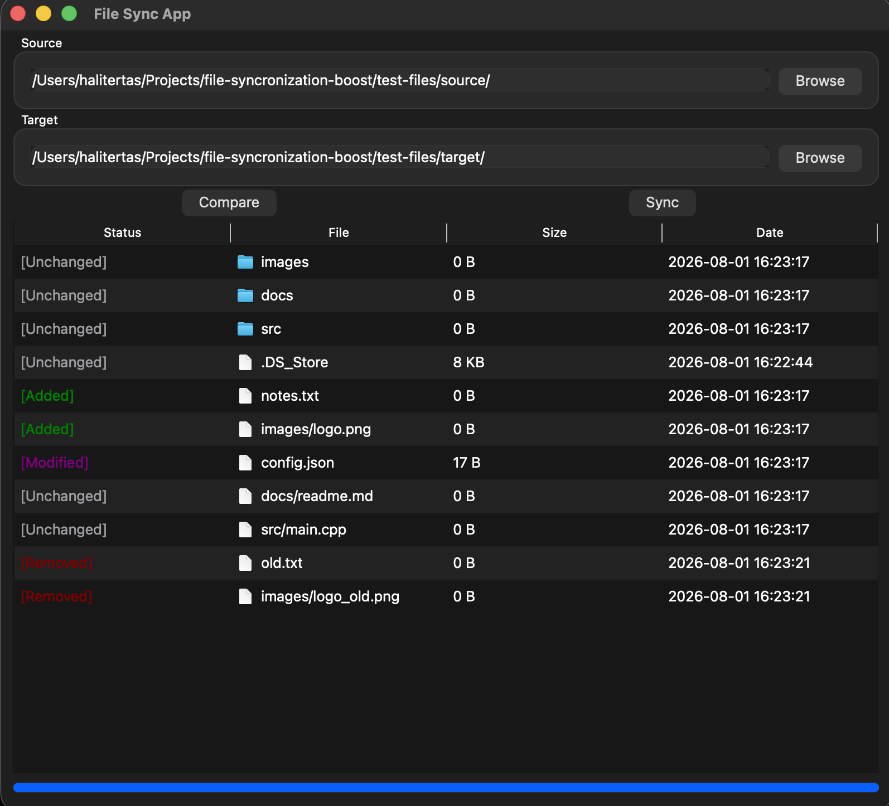

# File Synchronization Boost

A modern C++17 desktop application for comparing and synchronizing directories using Qt6.

## Screenshot

## Technologies

- C++17
- Qt6 Widgets
- CMake
- OpenSSL
- Boost
- std::filesystem

## Architecture

The project is divided into two main parts:

- FileSyncCore
  - File scanning
  - Directory comparison
  - Synchronization logic

- GUI
  - Qt Widgets interface
  - Progress bar
  - Background worker

### Synchronization

- Copy new files
- Remove deleted files
- Update modified files

## Supported Operations

Scan directories
Compare directories
Detect added files
Detect removed files
Detect modified files
Detect unchanged files
Synchronize directories
GUI
Background worker

## Requirements

- CMake 3.20+
- C++17 compiler
- Qt6
- Boost
- OpenSSL

## Getting Started

git clone <https://github.com/HalitErtas/file-syncronization.git>

cd file-sync

make

make run

## Project Structure

.
├── CMakeLists.txt
├── Makefile
├── core/
├── common/
├── gui/
├── docs/
└── README.md